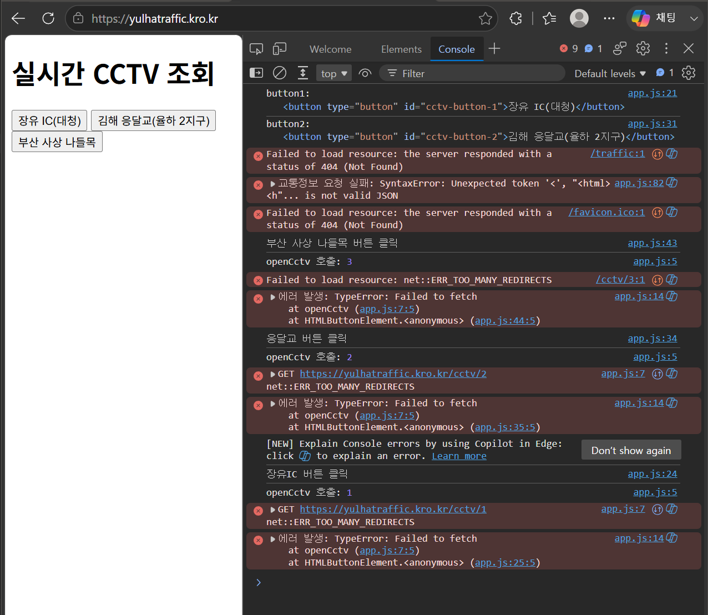

# 문제 : CCTV URL 요청 불가

# 증상
```
윈도우에서 https://yulhatraffic.kro.kr/ 접속 시 CCTV API 요청 실패
```



# 원인 분석
```
window - nginx - app 각 구간별 port, ip, curl 로그 조회, tcpdump 응답 확인


nginx 서버에서
(-k : ssl 인증 무시)
curl -k https://localhost/cctv/1
curl -k https://localhost/traffic

API 에러 발생

https로 요청받은 엔진엑스는 301코드와 dns명 응답한다.
그러나 다시 nginx의 요청을 받으라는 메세지가 발생함

"<head><title>301 Moved Permanently</title></head>"

nginx -> app tcpdump 확인 결과
sudo tcpdump -ni any host 192.168.0.4 and tcp port 80
curl -k https://localhost/cctv/1

요청 로그 없음을 확인
```

# 해결 방법
```
nginx.conf 파일
https 경로 proxy_pass 가 app이 아닌 nginx로 잘못 설정되어있음
```


