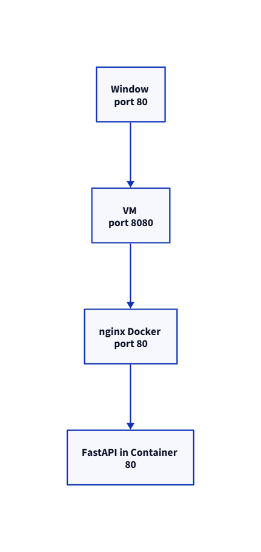

# 2026_08_27

## git / docker 설치
## sudo생략, 비밀번호 생략
```
dnf install git -y


도커설치 메뉴얼
https://docs.docker.com/engine/install/centos

#관리 명령어 플러그인 설치
 sudo dnf -y install dnf-plugins-core

# 로컬 리포지토리에 docker 리포지토리URL 추가
 sudo dnf config-manager --add-repo https://download.docker.com/linux/centos/docker-ce.repo

# 도커 패키지 설치
 sudo dnf install docker-ce docker-ce-cli containerd.io docker-buildx-plugin docker-compose-plugin


# docker 명령어 sudo 비밀번호 생략
sudo visudo
nginx_01 ALL=(ALL) NOPASSWD: ALL

# docker 명령어 sudo 생략
sudo usermod -aG nginx_01 docker

```


## git에서 소스코드 가져오기
```
cd /opt
git clone URL
```

## nginx conf 파일 설정하기
## 버전관리 시 traffic.disable
```
mkdir -p /etc/nginx/conf.d
vi /etc/nginx/conf.d/traffic.conf
```

## nginx 기본구조
```

# 워커 설정
main
events

    # 공통 http 설정
    http

        # 도메인:포트
        server1
            # url path
            location
                # 전달할 서버
                proxy_pass

        
    
        # 도메인:포트
        server2
            # url path
            location
                #전달할 서버
                proxy_pass

    # 메인페이지
    location / {
        # 로컬에서 파일찾기
        root /html 디렉토리
        index /html파일

        # 전달받을 서버
        proxy_pass http://192.168.0.4:80;

        proxy_set_header Host $host;
        proxy_set_header X-Real-IP $remote_addr;
        proxy_set_header X-Forwarded-For $proxy_add_x_forwarded_for;
        proxy_set_header X-Forwarded-Proto $scheme;
    }

```



```
