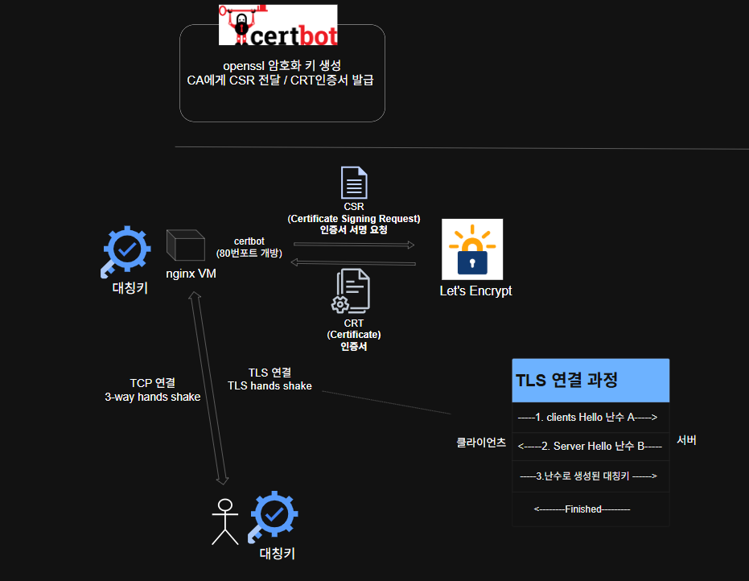

# 2026_08_28


## SSL/TLS 구축하기
```
[록키리눅스 Let's Encrypt SSL 키 생성 방법]
https://docs.rockylinux.org/zh/guides/security/generating_ssl_keys_lets_encrypt/?utm_source=chatgpt.com

# EPEL 저장소 활성화
sudo dnf config-manager --set-enabled crb

# 최신 EPEL 저장소 정보 설치
sudo dnf install epel-release -y

# /var/cache/dnf (캐시파일) 초기화, 새로고침
sudo dnf clean all
sudo dnf makecache

# 엔진엑스용 certbot 패키지 설치
dnf install certbot python3-certbot-nginx

# 엔진엑스 키 발급
sudo certbot certonly --standalone -d yulhatraffic.kro.kr

# 로컬에 발급된 CRT키와 개인키
/etc/letsencrypt/live/yulhatraffic.kro.kr/fullchain.pem
/etc/letsencrypt/live/yulhatraffic.kro.kr/privkey.pem
```

<<<<<<< HEAD


=======
## 도커 인증서 바인드 마운트로 띄우기
```
docker build -t nginx .

# 호스트에 존재하는 CRT와 개인키의 상위 디렉토리를 바인드마운트한다.
docker run -d --name nginx -p 80:80 -p 443:443 --mount type=bind,source=/etc/letsencrypt,target=/etc/letsencrypt,readonly nginx:latest

```

>>>>>>> 6557676 (docs: app구축.md 생성 appVM docker, git 설치, sudo 등록  완료, .env 파일 설정 필요)
