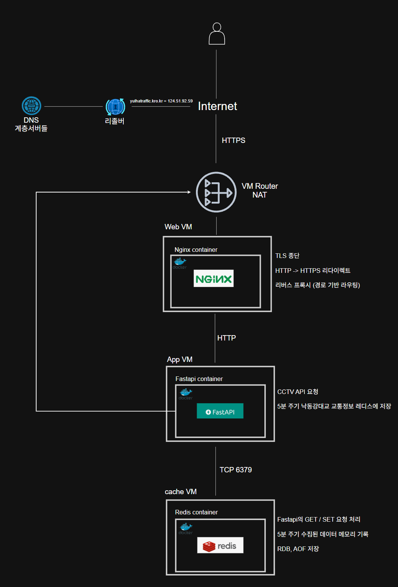
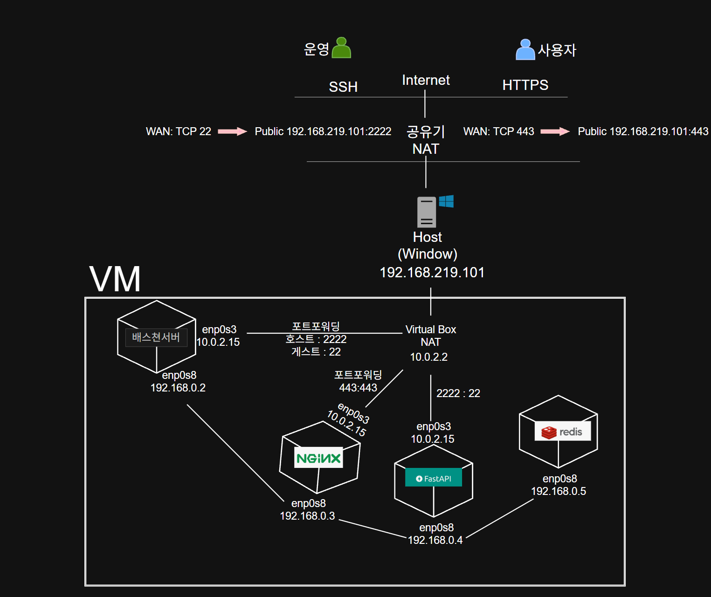

# 1. 프로젝트 소개
```
공공 교통정보 API를 이용하여 주요 정체 구간 실시간 CCTV 조회, 1시간 간격으로 낙동강대교 도로 정체 정보를 확인할 수 있습니다.
```

# 2. 아키텍처




# 3. 기술 스택
```
Linux
사용자권한 관리, 네트워크 설정, 방화벽, 로그 확인, 프로세스관리

Nginx
정적파일제공, Let's Encrypt 인증서를 사용하여 TLS적용, 리버스프록시 구성

Docker
네임드 및 바인드 마운트, 컨테이너 실행 환경 표준화

Fastapi
공공 교통 API 연동

Redis
수집한 교통 데이터 캐싱
애플리케이션 데이터 외부화

Ansible
계정 설정, 디렉토리, 네트워크, 도커 설치 등
서버 초기 설정 자동화
```


# 4. 네트워크 구성




# 5. 요청 흐름
```
Clients
-> DNS (https://yulhatraffic.kro.kr)
-> HTTPS
-> NGINX
-> Fastapi
-> redis
```

# 6. 보안 설정
```
ssh key
firewall
TLS
NAT, 폐쇄망 분리
Redis ACL

```

# 7. 개선 계획
```
Terraform을 이용한 AWS 마이그레이션
깃액션과 젠킨스 CI / CD
쿠버네티스로 다중 컨테이너 제어
```